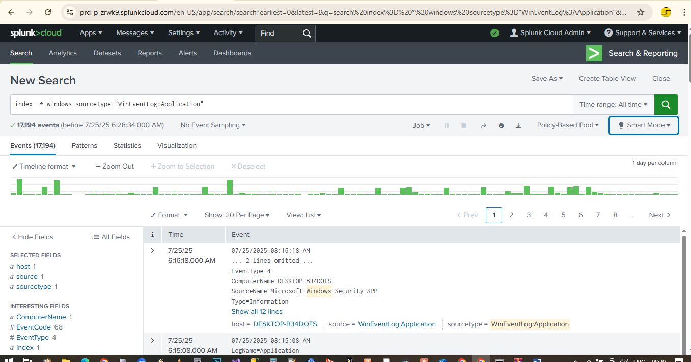

# windows-log-monitoring-splunk
Real-world cybersecurity monitoring project using the Splunk Universal Forwarder to collect and forward Windows system logs to Splunk Cloud for centralized analysis.

# Windows to Splunk Cloud Monitoring

A real-world cybersecurity and DevOps project that collects and forwards logs from a Windows 10/11 endpoint to **Splunk Cloud Trial** using the **Splunk Universal Forwarder**. Designed to showcase centralized log collection, SIEM integration, and threat detection with dashboards and alerts.

## Use Case

- Forward logs (Security, System, Application, PowerShell, Sysmon) from a local Windows PC
- Centralized monitoring using Splunk Cloud
- Visualize endpoint activity (logins, privilege escalation,script execution)

## Sample Dashboards

Here are some example visualizations included in this project:

### Login Activity Panel
Shows failed logon attempts per user.

Shows successful logins by user

### Priviledge Escalation Events
Detects priveledge escalation events by accounts so that we see if an unathorized account is gainging unathorized access.

### Top Event Codes
Here we have an overview of the most frequently triggered events. This dashboard can help us quickly identify bruteforce attacks or DDoS attack.

### Log Search
This is the Splunk Search and Reporting App which enable us to search for specific events.

